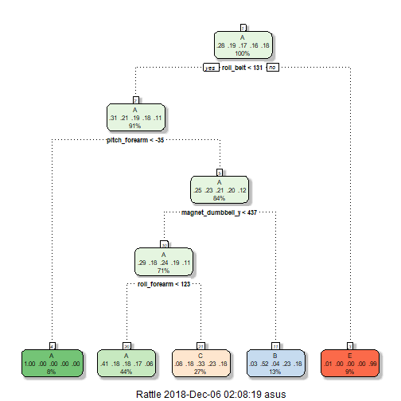
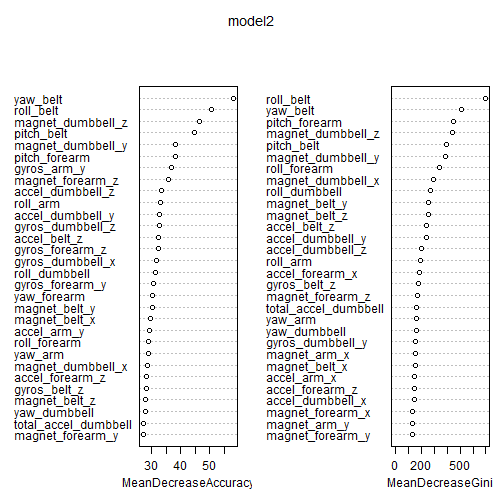

## Instruction

The goal of the project is to predict the manner how the accelerometer experiment is executed.
In this course project it is expected that the following activities are performed:
- model building
- cross validation
- sample error expectation
- evaluation of models
- prediction of test values

## Preparation of Required Packages

```r
install.packages("caret",repos = "http://cran.us.r-project.org")
```

```
## Installing package into 'C:/Users/asus/Documents/R/win-library/3.5'
## (as 'lib' is unspecified)
```

```r
library(caret)
```

```
## Loading required package: lattice
```

```
## Loading required package: ggplot2
```

```r
install.packages("randomForest",repos = "http://cran.us.r-project.org")
```

```
## Installing package into 'C:/Users/asus/Documents/R/win-library/3.5'
## (as 'lib' is unspecified)
```

```r
library(randomForest)
```

```
## randomForest 4.6-14
```

```
## Type rfNews() to see new features/changes/bug fixes.
```

```
## 
## Attaching package: 'randomForest'
```

```
## The following object is masked from 'package:ggplot2':
## 
##     margin
```

```r
install.packages("rattle",repos = "http://cran.us.r-project.org")
```

```
## Installing package into 'C:/Users/asus/Documents/R/win-library/3.5'
## (as 'lib' is unspecified)
```

```r
library(rattle)
```

```
## Rattle: A free graphical interface for data science with R.
## Version 5.2.0 Copyright (c) 2006-2018 Togaware Pty Ltd.
## Type 'rattle()' to shake, rattle, and roll your data.
```

```
## 
## Attaching package: 'rattle'
```

```
## The following object is masked from 'package:randomForest':
## 
##     importance
```

```r
library(lattice)
library(ggplot2)
```
## Retrieval and cleaning of data
The csv files are retrieved based on the given url. Columns that contain 90% mostly NA or empty string are removed. IDs are also removed since it is unnecessary for model building. 

```r
 trainData <- read.csv("https://d396qusza40orc.cloudfront.net/predmachlearn/pml-training.csv", header=TRUE) 
 testData <- read.csv("https://d396qusza40orc.cloudfront.net/predmachlearn/pml-testing.csv", header=TRUE)
 almostEmpty <- sapply(trainData, function(x) mean(is.na(x) | x == "")) > 0.90
 trainData <-trainData[,almostEmpty==FALSE]
 almostEmpty2 <- sapply(testData, function(x) mean(is.na(x)| x == "")) > 0.90
 testData <-testData[,almostEmpty2==FALSE]
 trainData<-trainData[,-(1:7)]
 testData<-testData[,-(1:7)]
```

## Data Partitioning
Through the caret package, the training data is partitioned into training and validation set.

```r
 set.seed(1234)
 intrain<- createDataPartition(y= trainData$classe,p=0.6, list = FALSE)
 train <- trainData[intrain,]
 validation <- trainData[-inTrain,]
```
## Decision Tree Modeling

```r
modFit <- train(classe~.,method="rpart",data=train)
print(modFit$finalModel)
```

```
## n= 11776 
## 
## node), split, n, loss, yval, (yprob)
##       * denotes terminal node
## 
##  1) root 11776 8428 A (0.28 0.19 0.17 0.16 0.18)  
##    2) roll_belt< 130.5 10774 7436 A (0.31 0.21 0.19 0.18 0.11)  
##      4) pitch_forearm< -34.55 919    2 A (1 0.0022 0 0 0) *
##      5) pitch_forearm>=-34.55 9855 7434 A (0.25 0.23 0.21 0.2 0.12)  
##       10) magnet_dumbbell_y< 436.5 8314 5944 A (0.29 0.18 0.24 0.19 0.11)  
##         20) roll_forearm< 122.5 5137 3022 A (0.41 0.18 0.18 0.17 0.061) *
##         21) roll_forearm>=122.5 3177 2124 C (0.08 0.18 0.33 0.23 0.18) *
##       11) magnet_dumbbell_y>=436.5 1541  743 B (0.033 0.52 0.039 0.23 0.18) *
##    3) roll_belt>=130.5 1002   10 E (0.01 0 0 0 0.99) *
```

## Decision Tree Plot




## Prediction of data using Decision Tree

```r
 prediction <- predict(modFit,newdata=validation)
 table(prediction)
```

```
## prediction
##     A     B     C     D     E 
## 10038  2582  5252     0  1645
```

```r
 print(confusionMatrix(prediction, validation$classe), digits=4)
```

```
## Confusion Matrix and Statistics
## 
##           Reference
## Prediction    A    B    C    D    E
##          A 4956 1548 1585 1428  521
##          B   95 1303  109  580  495
##          C  410  946 1728 1208  960
##          D    0    0    0    0    0
##          E   14    0    0    0 1631
## 
## Overall Statistics
##                                           
##                Accuracy : 0.4928          
##                  95% CI : (0.4858, 0.4998)
##     No Information Rate : 0.2805          
##     P-Value [Acc > NIR] : < 2.2e-16       
##                                           
##                   Kappa : 0.3389          
##  Mcnemar's Test P-Value : NA              
## 
## Statistics by Class:
## 
##                      Class: A Class: B Class: C Class: D Class: E
## Sensitivity            0.9052  0.34317  0.50497   0.0000  0.45218
## Specificity            0.6381  0.91864  0.78105   1.0000  0.99912
## Pos Pred Value         0.4937  0.50465  0.32902      NaN  0.99149
## Neg Pred Value         0.9452  0.85273  0.88125   0.8352  0.88944
## Prevalence             0.2805  0.19455  0.17533   0.1648  0.18481
## Detection Rate         0.2539  0.06676  0.08854   0.0000  0.08357
## Detection Prevalence   0.5143  0.13229  0.26910   0.0000  0.08429
## Balanced Accuracy      0.7716  0.63090  0.64301   0.5000  0.72565
```

```r
 ## use prediction model to test data
prediction <- predict(modFit,newdata=testData)
```

The Decision Tree Model has 49.28% accuracy. Another model can be tested whether it would yield higher accuracy.

## Prediction of data using Random Forest

```r
set.seed(100);
 trainSet <- sample(nrow(trainData),0.6*nrow(trainData),replace = FALSE)
 train <- trainData[trainSet,]
 valid <- trainData[-trainSet,]
model2 <- randomForest(classe ~ ., data = train, ntree = 500, mtry = 6, importance = TRUE)
model2
```

```
## 
## Call:
##  randomForest(formula = classe ~ ., data = train, ntree = 500,      mtry = 6, importance = TRUE) 
##                Type of random forest: classification
##                      Number of trees: 500
## No. of variables tried at each split: 6
## 
##         OOB estimate of  error rate: 0.72%
## Confusion matrix:
##      A    B    C    D    E class.error
## A 3359    2    0    0    2 0.001189414
## B   13 2232   10    0    0 0.010199557
## C    1   17 2067    3    0 0.010057471
## D    0    0   32 1870    0 0.016824395
## E    0    0    1    4 2160 0.002309469
```

```r
 # Predicting on train set
 predTrain <- predict(model2, train, type = "class")
 table(predTrain, train$classe) 
```

```
##          
## predTrain    A    B    C    D    E
##         A 3363    0    0    0    0
##         B    0 2255    0    0    0
##         C    0    0 2088    0    0
##         D    0    0    0 1902    0
##         E    0    0    0    0 2165
```

```r
 predValid <- predict(model2, valid, type = "class")
 # Checking classification accuracy
 mean(predValid == valid$classe) 
```

```
## [1] 0.9929927
```

```r
 table(predValid,valid$classe)
```

```
##          
## predValid    A    B    C    D    E
##         A 2211    8    0    0    0
##         B    6 1530    7    0    0
##         C    0    4 1322   13    1
##         D    0    0    5 1296    6
##         E    0    0    0    5 1435
```

```r
 prediction <- predict(model2,newdata=testData)
 prediction
```

```
##  1  2  3  4  5  6  7  8  9 10 11 12 13 14 15 16 17 18 19 20 
##  B  A  B  A  A  E  D  B  A  A  B  C  B  A  E  E  A  B  B  B 
## Levels: A B C D E
```



The random forest yields higher accuracy percentage of 99.3% as compared to the Decision Tree. The predicted values for the test data is generated.
